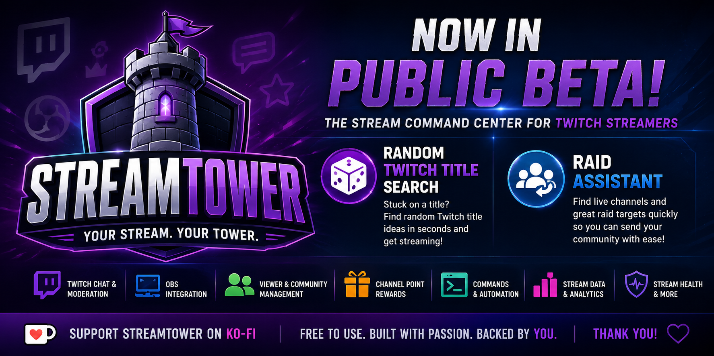

  

# 🏰 StreamTower
### Your Stream. Your Tower.

**The Stream Command Center for Twitch Streamers**

StreamTower is a Windows desktop application designed to bring Twitch, OBS, moderation, community management, stream automation, rewards, analytics, and other everyday streaming tools together in one command center.

> ⚠️ **StreamTower is currently in BETA.**
>
> Features may change and bugs are possible. Feedback, bug reports, and feature requests are welcome.

---

## 📥 Download StreamTower

### Latest Public Beta: v1.0.0-beta.48

Download the latest StreamTower installer from:

**[⬇️ DOWNLOAD STREAMTOWER](https://github.com/spidermonkeystreams/StreamTower-Releases/releases/latest)**

Or view all releases:

**[📦 VIEW ALL RELEASES](https://github.com/spidermonkeystreams/StreamTower-Releases/releases)**

---

# ⭐ Featured StreamTower Tools

## 🎲 Random Twitch Title Search

Can't think of a stream title?

StreamTower's **Random Twitch Title Search** helps you find Twitch title ideas so you can spend less time staring at the title box and more time getting your stream started.

## 🎯 Raid Assistant

Finding somewhere to raid at the end of a stream shouldn't be a chore.

**Raid Assistant** helps you discover potential Twitch raid targets, see who's live, and quickly decide where to send your community.

It's designed to make ending your stream and supporting another streamer easier.

---

# 📡 Features

StreamTower includes tools for:

- 💬 Twitch Creator Chat
- 🛡️ Twitch moderation
- 🎥 OBS integration
- 👥 Streamer & Regular viewer management
- 👋 First Words detection
- 🎬 Shoutout Clips
- 🎯 Raid Assistant
- 🎲 Random Twitch Title Search
- 🎁 Twitch Channel Point rewards
- ⌨️ Stream Commands
- 📢 Stream events & activity tracking
- 📊 Stream data & analytics
- ❤️ Stream Health tools
- 🎞️ Ending Credits
- ⚙️ Stream automation
- And more as StreamTower continues to grow

---

# 🚀 Getting Started

1. Download the latest StreamTower installer from **Releases**.
2. Run the installer.
3. Launch StreamTower.
4. Complete the **Twitch Setup** section.
5. Complete the **OBS Setup** section if you want to use OBS integration.
6. Configure the StreamTower tools you want to use.

Because StreamTower is currently in beta, please report anything that doesn't work as expected.

---

# 🐛 Found a Bug?

StreamTower is under active development and bug reports are extremely helpful.

When reporting a problem, please include:

- Your StreamTower version
- What you were doing when the problem occurred
- What you expected to happen
- What actually happened
- Any error message you received
- A screenshot if it helps explain the problem

You can report problems through the StreamTower Discord.

---

# 💡 Have a Feature Idea?

Have an idea that could make StreamTower more useful for streamers?

Feature requests and suggestions are welcome.

Join the StreamTower Discord and share your idea with the community.

---

# 💬 StreamTower Community

Need help, want to report a bug, suggest a feature, or follow development?

**[💬 JOIN THE STREAMTOWER DISCORD](https://discord.gg/A55RGtVXeM)**

---

# ☕ Support StreamTower

StreamTower is currently **free to use**.

If StreamTower is useful to you and you'd like to help support continued development, you can support the project on Ko-fi.

Support is appreciated, but never required.

**[☕ SUPPORT STREAMTOWER ON KO-FI](https://ko-fi.com/thespidermonkey983)**

---

# 📋 Current Version

**StreamTower v1.0.0-beta.48**

This repository is the official public release location for StreamTower.

---

## 🏰 StreamTower

**Your Stream. Your Tower.**

© 2026 theSpidermonkey983. All rights reserved.
